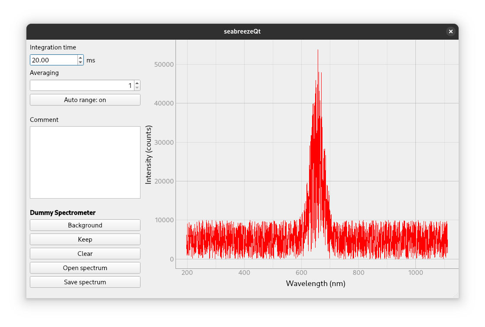

# seabreezeQt

GUI for the seabreeze python library. Tested with Maya2000 spectrometer.

## Keyboard shortcuts

- `B` - Substract background
- `K` - Keep current spectrum in the background
- `C` - Clear all background spectra
- `Ctrl + O` - Open spectrum
- `Ctrl + S` - Save spectrum

## seabreezeQt.py

Uses the [python-seabreeze](https://github.com/ap--/python-seabreeze) library to communicate with the spectrometer and displays it using the [PyQt](https://riverbankcomputing.com/software/pyqt/) library.

The GUI can be started by running `python seabreezeQt.py`.

### Required python libraries
  * seabreeze
  * PyQt5
  * pyqtgraph
  * sys
  * numpy
  
## MainWindow.ui

Contains the UI elements. Created with Qt designer.
